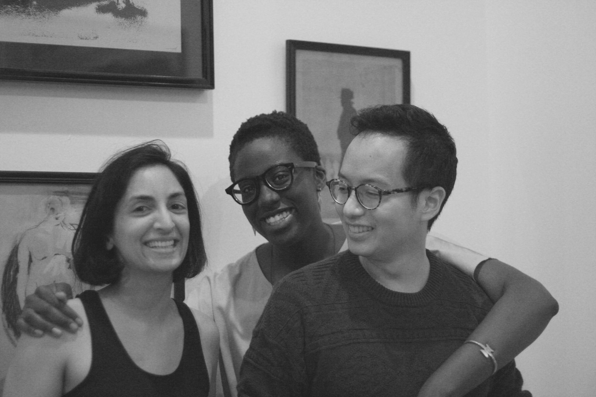

<fig>
  
  <figcaption>Samantha J. Pergadia, Aku Ammah-Tagoe, and Arthur Z. Wang at ASAP/10 in New Orleans, 2018</figcaption>
</fig>

A scholar of contemporary fiction, media, and feminist science and technology studies, **Arthur Z. Wang** studies how scientific concepts travel across contexts and assert universal applicability. 

His current book project, _Minor Theories of Everything_, is an interdisciplinary inquiry into the proliferation and propagation of scientific universalisms about human sociality since the 20th century, and their surprising uptake by feminists and writers of color. 

His second book project, tentatively titled _Making Scientific Lives_, investigates the co-formation of biographical media and the modern sciences, and traces tensions between ideals of scientific impersonality and the vibrant circulation of scientists’ life stories in academic and popular cultures. 

Currently a Provost's Postdoctoral Fellow at UPenn's Annenberg School for Communication, he received a Ph.D. in English from Yale University and before graduate school, worked as a software engineer.
