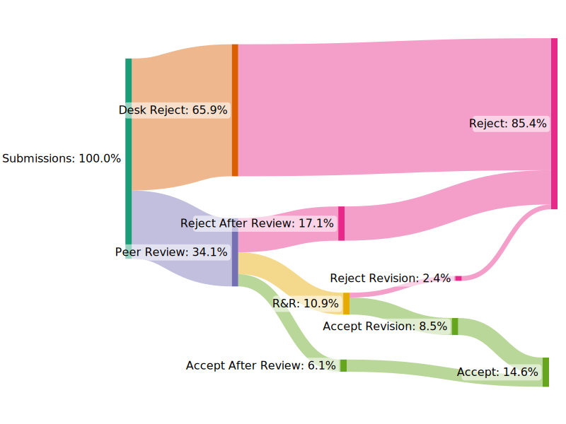

## Number of Articles Published by Post45

<iframe width="100%" height="514" frameborder="0"
  src="https://observablehq.com/embed/@post45/post45-published-articles-public-5-8-23?cells=articleChart"></iframe>

## Review and Publication Timelines: _Post45_ vs. Other Journals

 <iframe width="100%" height="750" frameborder="0"
  src="https://observablehq.com/embed/@post45/post45-timeline-comps-may-9-2023?cells=compsChart"></iframe>

Color scheme for the visualizations above: [Cheysson Palette](https://observablehq.com/@tomshanley/cheysson-color-palettes) licensed under ISC License (ISC) Copyright 2021 [Tom Shanley](https://observablehq.com/@tomshanley)

## Post45 Submission Outcomes since 2020 (excluding special issues)
<figure>
	<object type="image/svg+xml" data="../images/outcomes_sankey.svg" class="fitvidsignore"></object>
	<figcaption>
		Image created with <a href="https://sankeymatic.com/build/">SankeyMATIC</a>
	</figcaption>
</figure>
<!--  -->