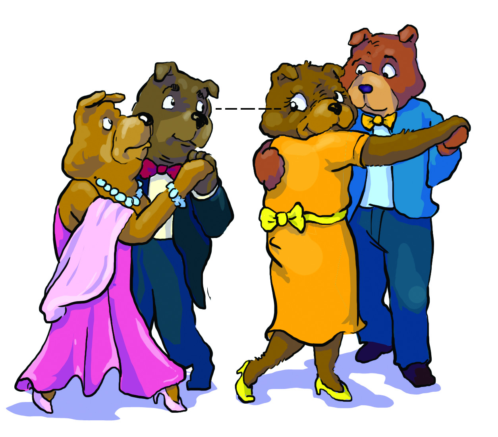
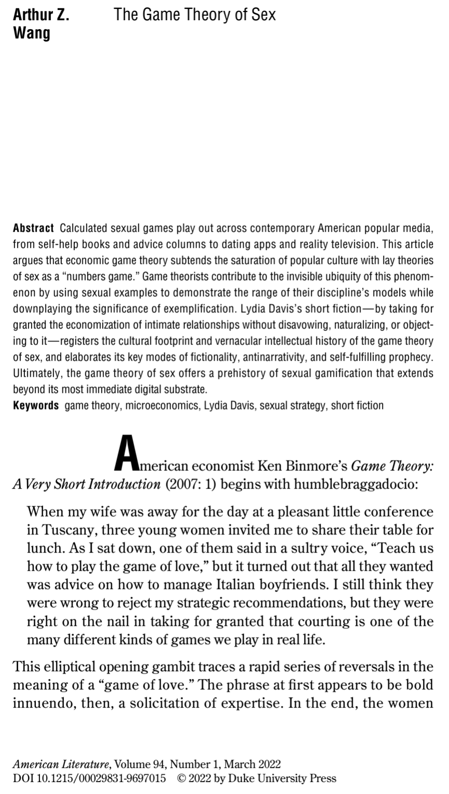

<!--
## Abstract

Calculated sexual games play out across contemporary American popular media, from self-help books and advice columns to dating apps and reality television. This article argues that economic game theory subtends the saturation of popular culture with lay theories of sex as a “numbers game.” Game theorists contribute to the invisible ubiquity of this phenomenon by using sexual examples to demonstrate the range of their discipline’s models while downplaying the significance of exemplification. Lydia Davis’s short fiction—by taking for granted the economization of intimate relationships without disavowing, naturalizing, or objecting to it—registers the cultural footprint and vernacular intellectual history of the game theory of sex, and elaborates its key modes of fictionality, antinarrativity, and self-fulfilling prophecy. Ultimately, the game theory of sex offers a prehistory of sexual gamification that extends beyond its most immediate digital substrate. -->

<fig>

<figcaption> "An Unstable Pair," figure from Anna R. Karlin and Yuval Peres, <i>Game Theory, Alive</i> (Providence: AMS, 2017), 180</figcaption>
</fig>

