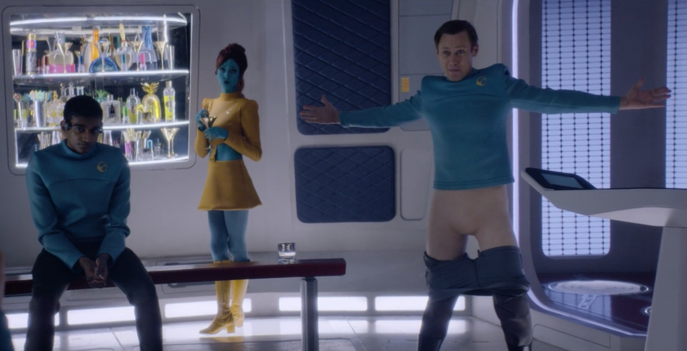

<figure>
  
  <figcaption><i>Black Mirror</i>, "USS Callister"</figcaption>
</figure>

**We're Still Here: Politicizing the Nonhuman Turn across Media** panel, organized by [Neta Alexander](https://www.colgate.edu/about/directory/nalexander)
